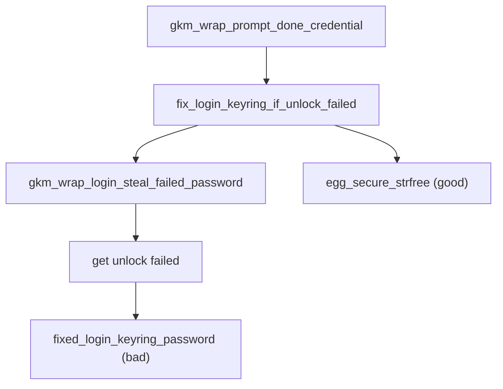
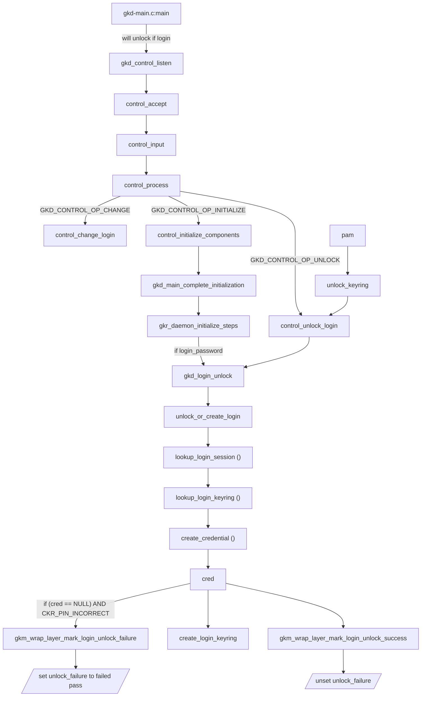

# logic flow




```c
gchar*
gkm_wrap_login_steal_failed_password (void)
{
	gpointer oldval;

	oldval = g_atomic_pointer_get (&unlock_failure);
	if (!g_atomic_pointer_compare_and_exchange (&unlock_failure, oldval, NULL))
		oldval = NULL;

	return oldval;
}
```

```c
/* Holds failed unlock password, accessed atomically */
static gpointer unlock_failure = NULL;
```

this is the only one that updates `unlock_failure` to new value:

```c
void
gkm_wrap_layer_mark_login_unlock_failure (const gchar *failed_password)
{
	gpointer oldval;
	gpointer newval;

	g_return_if_fail (failed_password);

	oldval = g_atomic_pointer_get (&unlock_failure);
	newval = egg_secure_strdup (failed_password);

	if (g_atomic_pointer_compare_and_exchange (&unlock_failure, oldval, newval))
		egg_secure_strfree (oldval);
	else
		egg_secure_strfree (newval);
}
```



```c
unlock_or_create_login (GList *modules, const gchar *master){
...
	if (cred == NULL) {
		if (login && g_error_matches (error, GCK_ERROR, CKR_PIN_INCORRECT))
			gkm_wrap_layer_mark_login_unlock_failure (master);
```

