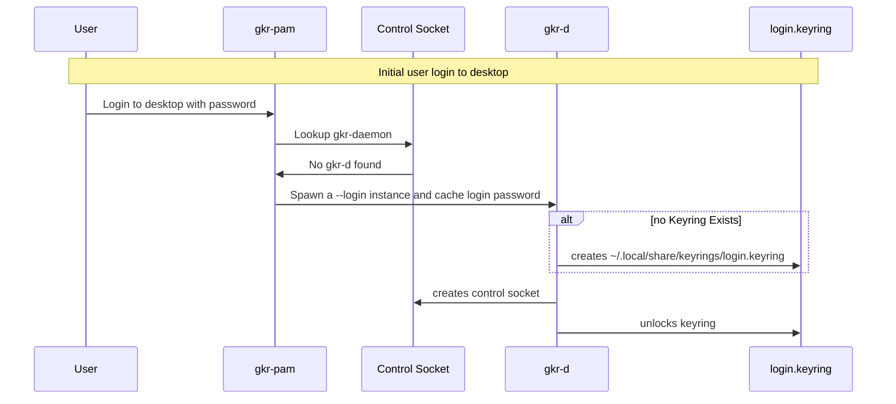

# debugging gnome-keyring

The motivation for this was that I found that my gkr login keyring password had
changed, and no longer matched my login password. I had not changed either
explicitly, nor had I updated any packages that might trigger this behaviour,
so I was interested to find out exactly what gnome-keyring was doing.

Normally, one could run a problem application under strace or gdb, and inspect
what it is doing. In the case of gnome-keyring, the application is run under the control of system components such as pam and dbus, and its behaviour is tied
to various lifecycle and specific input file descriptors (password given as stdin
to daemon) which makes simple tracing difficult.

The more general motivation, is that I want to have available a toolset that can
be used to trace the behaviour of arbitrary applications without modifying or
having to completely rebuild an instrumented test environment with lots of 
custom systemd unit files and startup scripts.

This role "limepepper.debug.gnome_keyring" is used to add a bunch of debugging
instrumentation to a fedora-41 desktop:

```shell
ansible-playbook -v limepepper.debug.run_role \
  -e run_role_name=gnome_keyring \
  -e run_role_become=false \ # don't sudo as ansible_user is root
  -l fedora41-gnome-debug \ # libvirt instance created for testing
  --diff \
  --tags gkr
```

## Incident summary 

At the time of the incident, I had rebooted my desktop due to package updates, 
upon opening (I believe) vscode, I was presented with a "The login keyring did not get unlocked when you logged into your computer" dialog, requesting a password. When I 
entered my login password, it was not accepted. I tried a bunch of different 
passwords, and then checked the `login.keyring` file, which had been recently
updated.

Upon consulting my backups, I found that no recent backup could be unlocked 
with my login password. I proceeded through the historical backups, until I found
one that could be unlocked which was from the 11/May some 10 days before. This
was odd, as I had been using vscode and other applications which use libsecrets
frequently in that period.

Initially I suspected some memory problem related to the unusual and unique log entry: "couldn't allocate secure memory".

I had claude generate a test script to try and decrypt the [locked
keyring](https://github.com/tolland/gnome-keyring/blob/806e52e28eae975cf20f591a5839638d5e9c6de3/pkcs11/secret-store/test-login-keyring-passwords.c#L86), this succeeded and provided
evidence that the problem was probably deterministic, as pulling a random piece
of memory would likely produce a nonsensical hex value which could not be 
decrypted rather than the string '\n'.

A while later, after using gdb to trace something in another project, it occurred
to me to set up something to trace gkr and leave it running, to see if I could
catch and log bad password updates for future occurrences.

I investigated various tools such as auditd, bpftrace, incrond, gdb, lldb, 
dbus-monitor, and LD_PRELOAD modules to instrument processes under these
circumstances.

Ultimately, the solution was found because it was obvious from diving into the 
code that logs from the incident represented a specific type of interaction with
gkr that wasn't present within normal gkr operations.

## Gnome keyring daemon

The gnome-keyring package provides a [secrets service](https://www.freedesktop.org/wiki/Specifications/secret-storage-spec/) implementation which is 
used in various places in linux distros, even if you are not running 
gnome-desktop. For example, here is a rocky 9.6 headless lxc container I have:

```shell
[root@bacula ~]# hostnamectl | grep 'Operating System'
Operating System: Rocky Linux 9.6 (Blue Onyx)
[root@bacula ~]# cat /etc/pam.d/passwd
#%PAM-1.0
# This tool only uses the password stack.
password   substack     system-auth
-password   optional   **pam_gnome_keyring.so use_authtok** # <<-- starts gkr-d
password   substack     postlogin
```

And here is something similar from a laptop running Ubuntu:

```
root@laptop:~# cat /etc/pam.d/common-password

... snipped

# and here are more per-package modules (the "Additional" block)
password        optional        pam_gnome_keyring.so
# end of pam-auth-update config
```

The Secrets API allows the user, and client applications to store secrets
in a service running in the user's desktop session. Applications wishing to
store or retrieve a credential make a request over dbus,
and some dbus activated service, by default gnome-keyring, responds with the 
requested information. This process triggers prompts to the user if unlocking
is necessary at that time.

The secrets are stored in a file located at `~/.local/share/keyrings/login.keyring` 
and this format is gkr specific and documented [here](https://gitlab.gnome.org/GNOME/gnome-keyring/-/blob/main/docs/file-format.txt?ref_type=heads). The 
best way I found to inspect this file directly, was to build the project from
source, and use the resulting `dump-keyring0-format` [utility](https://gitlab.gnome.org/GNOME/gnome-keyring/-/blob/main/pkcs11/secret-store/dump-keyring0-format.c?ref_type=heads) to look at the data. 

The gnome-keyring-daemon (gkr-d) uses a unix socket by default at 
`/run/user/$UID/keyring/control` to 
[communicate](https://github.com/tolland/gnome-keyring/blob/806e52e28eae975cf20f591a5839638d5e9c6de3/daemon/control/gkd-control-server.c#L216-L245) between instances of the daemon. The
control socket exposes [operations](https://gitlab.gnome.org/GNOME/gnome-keyring/-/blob/main/daemon/control/gkd-control-codes.h?ref_type=heads#L24-36) INITIALIZE, UNLOCK, CHANGE and QUIT.

Once started, gkr is a dbus activated service on the `org.freedesktop.secrets` 
bus, which responds transparently with credentials, or triggers gcr-prompter to
display a dialog to the user, if an unlock password is required.

The startup flow is something like this:



The `login.keyring` is encrypted with a master password, which is usually the same
as the user's login password. gkr attempts to keep this master password in sync
with the user password in several ways. If the gkr-pam module can find a daemon
on the control socket, it can change or set the password from pam. However, if
not it falls back to spawning a gkr instance, in which it caches the login 
password, which is later used to update the `login.keyring` master password.
This process is a bit odd, and can lead to problems.

## Bug logs summary

it turns out that the problem was caused by running a test suite in another app
that tried to start a gkr daemon for testing purposes with a simple password.
This caused gkr to reset the `login.keyring` to the password, which it trusts to
come from a reliable source. The journal recorded the following entries:

```journal
May 10 06:39:45 desktop gnome-keyring-daemon[3310]: discover_other_daemon: 1
May 10 06:39:45 desktop gnome-keyring-daemon[209976]: discover_other_daemon: 0
May 10 06:39:45 desktop gnome-keyring-daemon[209976]: Replacing daemon, using directory: /run/user/1000/keyring
May 10 06:39:45 desktop gnome-keyring-daemon[209976]: failed to unlock login keyring on startup
May 10 13:51:14 desktop gnome-keyring-daemon[209976]: couldn't allocate secure memory to keep passwords and or keys from being written to the disk
May 10 13:51:14 desktop gnome-keyring-daemon[209976]: fixed login keyring password to match login password
```

After the above sequence, the keyring password is changed transparently, which
can lead to some hard to intuit behaviour.

When an application that is using gnome-secrets as its credentials provider requests a credential over dbus, gkr is activated. The logs for the
sequence of trigger this request look like this:

```

May 10 13:51:06 desktop systemd[2901]: Started dbus-:1.2-org.gnome.keyring.SystemPrompter@0.service.
May 10 13:51:06 desktop gcr-prompter[747530]: GLib-GIO: Using cross-namespace EXTERNAL authentication (this will deadlock if server is GDBus < 2.73.3)
May 10 13:51:06 desktop gcr-prompter[747530]: Gcr: bus acquired: org.gnome.keyring.SystemPrompter
May 10 13:51:06 desktop gcr-prompter[747530]: Gcr: registering prompter
May 10 13:51:06 desktop gcr-prompter[747530]: Gcr: bus acquired: org.gnome.keyring.PrivatePrompter
May 10 13:51:06 desktop gcr-prompter[747530]: Gcr: acquired name: org.gnome.keyring.SystemPrompter
May 10 13:51:06 desktop gcr-prompter[747530]: Gcr: received BeginPrompting call from callback /org/gnome/keyring/Prompt/p3@:1.804
May 10 13:51:06 desktop gcr-prompter[747530]: Gcr: preparing a prompt for callback /org/gnome/keyring/Prompt/p3@:1.804
May 10 13:51:06 desktop gcr-prompter[747530]: Gcr: creating new GcrPromptDialog prompt
May 10 13:51:06 desktop gcr-prompter[747530]: GLib-GIO: _g_io_module_get_default: Found default implementation gvfs (GDaemonVfs) for ‘gio-vfs’
May 10 13:51:06 desktop /usr/libexec/gdm-x-session[2975]: (--) NVIDIA(GPU-0): DFP-0: disconnected
...
May 10 13:51:06 desktop /usr/libexec/gdm-x-session[2975]: (--) NVIDIA(GPU-0):
May 10 13:51:06 desktop gcr-prompter[747530]: Gcr: automatically selecting secret exchange protocol
May 10 13:51:06 desktop gcr-prompter[747530]: Gcr: generating public key
May 10 13:51:06 desktop gcr-prompter[747530]: Gcr: beginning the secret exchange: [sx-aes-1]\npublic=Un9ecVQXgNHAxzP6Oc...
May 10 13:51:06 desktop gcr-prompter[747530]: Gcr: calling the PromptReady method on /org/gnome/keyring/Prompt/p3@:1.804
May 10 13:51:06 desktop gcr-prompter[747530]: Gcr: acquired name: org.gnome.keyring.PrivatePrompter
May 10 13:51:06 desktop gcr-prompter[747530]: Gcr: returned from the PromptReady method on /org/gnome/keyring/Prompt/p3@:1.804
May 10 13:51:06 desktop gcr-prompter[747530]: Gcr: received PerformPrompt call from callback /org/gnome/keyring/Prompt/p3@:1.804
May 10 13:51:06 desktop gcr-prompter[747530]: Gcr: receiving secret exchange: [sx-aes-1]\npublic=E9MJh25xAY76bxALIVw...
May 10 13:51:06 desktop gcr-prompter[747530]: Gcr: deriving shared transport key
May 10 13:51:06 desktop gcr-prompter[747530]: Gcr: deriving transport key
May 10 13:51:06 desktop gcr-prompter[747530]: Gcr: starting password prompt for callback /org/gnome/keyring/Prompt/p3@:1.804
May 10 13:51:06 desktop /usr/libexec/gdm-x-session[2975]: (--) NVIDIA(GPU-0): Idek Iiyama PLX2783H (DFP-6): connected
...
May 10 13:51:06 desktop /usr/libexec/gdm-x-session[2975]: (--) NVIDIA(GPU-0):
```

## Red herring

The log includes the following

```
May 10 13:51:14 desktop gnome-keyring-daemon[209976]: couldn't allocate secure memory to keep passwords and or keys from being written to the disk
```

gkr uses some secure memory functions which seem to try to prevent memory being
used that can be paged out, or otherwise observed externally. The log above 
indicates that gkr was unable to allocate a block of secure memory and fell back
to malloc, or some default method. This log was a unique entry in several months
of journal logs, so I assumed it was important and substantial. However, it seems
that the cause of my behaviour was quite simple and unrelated. I don't know what
caused that inability to allocate secure memory, as I don't see any corresponding
OOM kills, but I would like to be able to correlate these issues in future.

## Todo / future ideas

- How to respond to dbus activated prompt in headless environment for testing?
- How to provide simple service for syslog calls in this situation?
- bpftrace seems super powerful. There is a project [BPF compiler collection](https://github.com/iovisor/bcc) 
which has lots of interesting tracing tools based on bpf
- gnome-boxes is a simple ui frontend. does it have a "box" format to encapsulate
a libvirt/qemu instance in a redistributable format?
- Investigate valgrind.
- Automating qemu deployment and desktop UI testing in openQA. For example this 
is good <https://openqa.fedoraproject.org/tests/3503965>

## Links

- My notes on the incident on the redhat bugzilla on a similar report:
<https://bugzilla.redhat.com/show_bug.cgi?id=2356002>
- The line of code that probably caused the issue:
<https://src.fedoraproject.org/rpms/firefox/blob/rawhide/f/run-wayland-compositor#_23>
- bug report raised on mozilla bugzilla, though I think now it was probably the
fedora package rebuilding that caused the reset <https://bugzilla.mozilla.org/show_bug.cgi?id=1975634>
- My post on gnome's discourse: <https://discourse.gnome.org/t/troubleshooting-no-longer-matches-that-of-your-login-keyring-problem/29019>
- post which I wish I had found earlier: <https://www.virtualcuriosities.com/articles/2556/gnome-keyring-daemon-unlock-changed-my-password> with some 
good background and explanation.
- openQA test failure that might be related: "Fedora openQA keyring test frequently
fails with error about password no longer matching login keyring, even though it has not changed" <https://gitlab.gnome.org/GNOME/gnome-keyring/-/issues/165> Looking at the flow now, it's not related.
- link to gnome gitlab issues for gnome-keyring <https://gitlab.gnome.org/GNOME/gnome-keyring/-/issues/?sort=created_date&state=opened&first_page_size=100>
